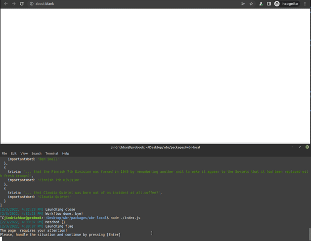

# WBR - Web Browser Robot 🤖🔮

<h1 align="center">
    
</h1>

**Web Browser Robot** is a one-stop shop for creating, running, and managing **web crawlers** and **automated web tasks** _with ease_.

[](https://www.npmjs.com/package/@wbr-project/wbr-interpret)
[](https://www.npmjs.com/package/@wbr-project/wbr-interpret)
[](https://github.com/airbnb/javascript)
[](https://github.com/barjin/wbr/actions/workflows/eslint-linter.yml)
[](https://github.com/barjin/wbr/actions/workflows/e2e-tests.yml)
[](https://github.com/barjin/wbr/actions/workflows/unit-tests.yml)
[](https://choosealicense.com/licenses/mit/)
___

## Web Browser Robot

Forget everything you know about tedious asynchronous programming in Playwright or Puppeteer and focus on what you really want to achieve instead. Using an intuitive **if-this-then-that** schema, optimized concurrency with zero run conditions, and state-of-art backend technology, creating crawlers and automations has never been easier.

## Installation
```bash
npm i -S @wbr-project/wbr-interpret
```

This installs the package into the `node_modules` folder of your project. The package also includes [Typescript](https://www.typescriptlang.org/) typings by default to facilitate its usage.

Now you are all set!

## Made for people, tailored to devs

With WBR, even a complete beginner can start scraping and crawling in no time. See the [docs](./docs/) and read for yourself how you can create your first scraper/crawler/automation with WBR.

Are you *way too senior* for this child's play? We've got you covered. WBR allows you to embed your own high-performance code into its syntax, effectively combining the generic easy-to-maintain nature of Smart Workflows and specific niche actions crucial for your use case. From the outside, the programmed user actions are indistinguishable from native WBR's actions. 

## Example

Creating _lightning-fast web automations_ with WBR is easier than you think - nobody likes to [spend 8 hours writing an automation to a 1-hour task](https://xkcd.com/1319/). Consider the following snippet:

```javascript
[{
    where: {
        url: "https://wikipedia.org"
    },
    what: [
        {
            action: "scrape",
        }
    ]
}]
```

This code snippet is a 100% valid WBR workflow definition. What does it do? **It scrapes `https://wikipedia.org`**. Yes, yes, not very impressive, I know. 

In that case, take a look at this one:

```javascript
[{
    where: {
        selectors: [
            "form input[type=text]",
            "form input[type=password]",
        ]
    },
    what: [
        {
            action: "fill",
            args: [
                "form input"
                "login@login.com"
            ]
        },
        {
            action: "fill",
            args: [
                "form input[type=password]"
                "verysecretpassword"
            ]
        },
        {
            action: "keyboard.press",
            args: "Enter"
        }
    ]
}]
```

What does this one do? On a page (any page) with a login form, this Smart Workflow fills in the login form and hits `Enter`, effectively logging the user in. This demonstrates many strengths of the Smart Workflow philosophy - they are highly reusable, as generic as possible, and help you automating your use cases while writing less code, only describing what you really want to do.


See the complete official format definition at [apify/waw-file-specification](https://github.com/apify/waw-file-specification).

See more examples and explanations in the [docs](./docs/).

<h2 align="center">
    
</h2>

## Legal 

Made in collaboration with [Apify](https://apify.com/) and [MFF UK](https://mff.cuni.cz), 2021-2022.
