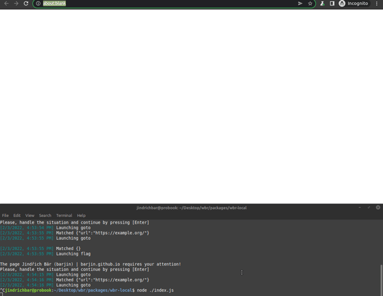

# Creating your first workflow

You have [installed the interpreter](./README.md), got familiar with [all the options](./interpreter.md) and have a tedious task to automate. What now?

Writing a Smart Workflow is a very simple task, not requiring much programming knowledge. Feel free to experiment, copy-paste and edit following examples, finding out what works the best for you.

```javascript
const workflow = {
    workflow: [
        {
            where: {},
            what: [
                {
                    type: 'goto',
                    params: 'https://example.org'
                }
            ]
        }
    ]
};
```

After [running this workflow](./interpreter.md#running-a-workflow), we see that the interpreter opens the [example page](https://example.org) (reloads it a few times) and terminates. Not too shabby, right? 

This is because there is only one rule defining an action (go to https://example.org) with an empty condition (meaning it is always applicable).

```javascript
const workflow = {
    workflow: [
        {
            where: {
                url: 'https://example.org/'
            },
            what: [
                {
                    type: 'goto',
                    params: 'https://jindrich.bar'
                }
            ]
        },

        {
            where: {},
            what: [
                {
                    type: 'goto',
                    params: 'https://example.org'
                }
            ]
        }
    ]
};
```

Now we added another rule to the workflow specification. Whenever the robot gets to the page "https://example.org/", it navigates to "https://jindrich.bar" - and in all the other cases, it goes to "https://example.org". Effectively, this means the robot will bounce between those two pages indefinitely (try to think, when does which rule apply). So far, it is pretty straightforward, right? 

<center>

</center>

## Intermezzo: Order matters!

There is another thing to notice, though. This example demonstrates that the order of the rules in the workflow matters. Try for yourself what happens, if you switch the order of the rules (i.e. first the general rule, then the one for https://example.com).

If you successfully managed to update the workflow, you might see that the interpret keeps reloading the `example.org` webpage, never visiting `jindrich.bar`. This is because it first sees the general rule, which it immediately matches (the empty condition is saying "match me anytime"), never visiting the second rule.

Bear this in mind while creating your own workflows - **the more specific action, the sooner it should be mentioned**.

> **Extra tip:** In case you are having troubles with finding the correct condition, try running the interpret with `{debug: true}` option. This way, it prints the entire observable state of the website for you, making it easier to spot mistakes in your patterns (e.g. trailing slashes in URLs etc).

## Let's get clicking!

With the formalities out of our way, we can finally start creating something useful. For our example workflow, let's say you want to go to the Wikipedia homepage and scrape the daily "Did you know..." trivia section. 

Just like before, we can start by simply navigating to the correct URL, in our case it is `https://wikipedia.org`:

```javascript
const workflow = {
    workflow: [
        {
            where: {},
            what: [
                {
                    type: 'goto',
                    params: 'https://wikipedia.org'
                }
            ]
        }
    ]
};
```

This brings us to the language selection page. On this page, we would like to click the link labeled "English". 


```javascript
const workflow = {
    workflow: [
        {
            where: {
                url: "https://www.wikipedia.org/"
            },
            what: [
                {
                    type: 'click',
                    params: ':text("English")'
                }
            ]
        },
        {
            where: {},
            what: [
                {
                    type: 'goto',
                    params: 'https://wikipedia.org'
                }
            ]
        }
    ]
};
```

The `click` action (just like all the others, e.g. `goto`, `fill` or `keyboard.press`) corresponds to the [Playwright Page's click method](https://playwright.dev/docs/api/class-page#page-click). The `params` field then specifies the parameters for this method, in this case the [selector of the element](https://playwright.dev/docs/selectors) we want to click on.

Right now, we are only one step from finishing our automation. Clicking the "English" button takes us to the english version of Wikipedia, where we can simply scrape the results using third rule.

```javascript
const workflow = {
    workflow: [
        {
            where: {
                selectors: [':text("Did you know ...")']
            },
            what: [
                {
                    type: 'scrapeSchema',
                    params: {
                        "trivia": "#mp-dyk > ul li",
                        "importantWord": "#mp-dyk > ul li b"
                    }
                },
                {
                    type: 'close'
                }
            ]
        },
        {
            where: {
                url: "https://www.wikipedia.org/"
            },
            what: [
                {
                    type: 'click',
                    params: ':text("English")'
                },
                {
                    type: 'waitForLoadState'
                }
            ]
        },
        {
            where: {},
            what: [
                {
                    type: 'goto',
                    params: 'https://wikipedia.org'
                }
            ]
        }
    ]
};
```
The top rule matches whenever is sees text "Did you know ..." and runs the schema scraper - a clever little piece of code which reads the text in the elements you specify with the selectors, takes care of pairing it with its neighbors and related info and sends them into the robot's serializable output.

<center>

</center>

## What now?

Great job, you have just finished your first scraper! There is nothing stopping you now.
Keep in mind there are many more things you can do (e.g. login into a webpage, take a serie of screenshots or order a pizza) using WBR. Do you already have an idea for a great, useful scraper? 

Continue reading to learn how to write parallel workflows for faster execution or how run your own JS code inside the workflows *(coming soon)*.