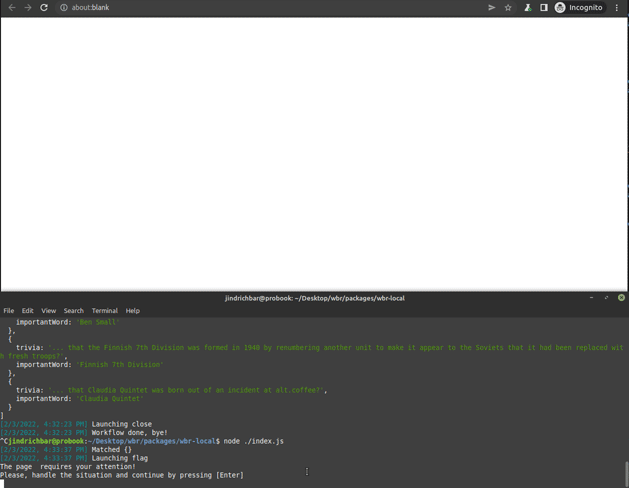

# Web Automation Workflow (WAW) format definition

The following document is considered the official definition of the Web Automation Workflow (waw) format.

For more information about how to run the workflow from your code, please see the [main readme page](../README.md).

**Table of content:**
- [General overview](#general)
- [Meta Header](#meta-header)
- [Workflow](#workflow)
- [Where conditions](#the-where-clause)
	- [Basics](#where-conditions---the-basics)
	- [Boolean logic](#where-conditions---boolean-logic)
	- [Ordering]()
	- [State persistence](#metaprogramming-state-persistence)
- [What actions](#the-what-clause)
	- [Custom functions](#custom-functions)

## General

The `.waw`  *(not to be confused with .wav)* file is a textual format used for quick, safe and declarative definition of web automation workflows.

Syntactically, `.waw` should always be a valid `.json` file. If you are unsure what `.json` is, refer to the [official documentation](https://www.json.org). 

*Note: From now on, the .waw file will be considered a valid JSON file and all the terminology (object, array) will be used in this context.*

On the top level, the workflow file contains an object with two properties - `"meta"` - an object with the [workflow's metadata](#meta-header) (accepted parameters etc.) and `"workflow"` - a **single array** of so-called "where-what pairs". These pairs contain three properties with keys `name`, `where`, and `what`. 

> The `name` property is solely for referencing and can be omitted.

Here follows a top-level view of the Workflow file:

```javascript
{
	"meta" : {
		...
	}
	"workflow": [
		{
			"name": "login",
			"where": {...},
			"what": [...]
		},
		{
			"name": "signup",
			"where": {...},
			"what": [...]
		},
		...
	]
]
```

## Meta Header 
As of now (27.12.2021), the `meta` header of the file contains three fields: 
- "name" - `string` - optional, name of the workflow (for easier management)
- "desc" - `string` - optional, text description of the workflow.
Even though all the metadata is optional, developers are strongly advised to use them for clarity and easier management of the workflows. 

### Example
```json
{
	"name": "Google Maps Scraper",
	"desc": "A blazing fast scraper for Google Maps search results."
}
```
## Workflow
The "workflow" part of the workflow is a single **array** consisting of the where-what pairs - objects describing desired behavior in different situations. 

For example, let's say we want to click on a button with the label "hello" every time we get on the page "https://example.com/". This behavior is described with the following snippet:

```json
{
	"where": { "url": "https://example.com" },
	"what": [
		{
			"type": "click",
			"params": "button:text('hello')"
		}
	]
}
```

Now, let's say we want to type "Hello world!" into an input field, whenever we see an input field on the "https://example.com" website:

```json
{
	"where": { 
		"url": "https://example.com",
		"selectors": "input"
	},
	"what": [
		{
			"type": "type",
			"params": [
				"input",
				"Hello world!"
			]
		}
	]
}
```

This should be enough to give you some basic understanding of the WAW Smart Workflow format. In the following sections, there are more details about the format and its certain features. 

## The Where Clause
The Where clause describes a **condition** required for the respective What clause to be executed. 

> In the basic version without the  "state/metaprogramming" part (more later), we can count with the Markov assumption, i.e. the Where clause always depends only on the current browser state and its "applicability" can be evaluated statically, knowing only the browser's state at the given point. For this reason, the workflow can be executed on different tabs in parallel (any popup window open from the first passed page is processed as well).

### Where conditions - The Basics
The `where` clause is an object with various keys. As of now, only three keys are recognized:
- URL *(string)*
- cookies *(object with string keys/values)*
- selectors *(array of CSS/[Playwright](https://playwright.dev/docs/selectors/) selectors - all of the targetted elements must be present in the page to match this clause)*

An example of a full (simple, flat) Where clause:

```javascript
	"where": {
		"url": "https://jindrich.bar/",
		"cookies": {
			"uid": "123456"
		},
		"selectors": [
			":text('My Profile')",
			"button.logout"
		]
	}
```

### Where conditions - (Boolean) Logic
For a system operating with conditions, is it crucial to have a simple way to work with formal logic.
The WAW format is taking inspiration from the [MongoDB query operators](https://docs.mongodb.com/manual/reference/operator/query/), as shown in the example below:

```javascript
	"where": {
		"$and": [
			{
				"url": "https://jindrich.bar/",
			},
			{
				"$or": [
					{
						"cookies": {
							"uid": "123456"
						}
					},
					{
						"selectors": [
							":text('My Profile')",
							"button.logout"
						]
					}
				]
			}
		]
	}
```
This notation describes a condition where the URL is `https://jindrich.bar/` **and** there is **either** the `uid` cookie set with the specified value, **or** there are the selectors present. Please note that the top-level `$and` condition is redundant, as the conjunction of the conditions is the implicit operation.

### Ordering

Note that the ordering of the rules in the file is crucial. Consider the following example:

```json
...
	{
		"where": { "url": "https://jindrich.bar" },
		"what": [{ "action A" }]
	},
	{
		"where": { "url": "https://jindrich.bar" },
		"what": [{ "action B" }]
	},
...
```

The `where` conditions in the displayed pairs are the same, i.e. when the interpreter gets to the webpage `https://jindrich.bar`, it has two possible action sequences to carry out. This situation makes little sense, as the workflow definition needs to be as strict as possible and cannot allow non-deterministic behaviour of the interpreter.

For this reason, the definition of the workflow file says that **only the first matching action** gets executed.

Even though the colliding conditions were easy to spot in the example above, this problem can get a little more nuanced, for example:

```json
...
	{
		"where": { 
			"selectors": ["h1", "ul"]
		},
		"what": [{ "action A" }]
	},
	{
		"where": { 
			"selectors": [".large-heading","#list"]
		},
		"what": [{ "action B" }]
	},
...
```

While there is no visible collision in the described conditions, the interpreter behavior might be surprising on the following page:

```html
...
	<h1 class="large-heading">Heading</h1>
	<ul id="list">
		<li>a</li>
		...
	</ul>
...
```

Again, the interpreter will execute only `action A`, even though both conditions apply.

> Another way to think of this is "put more specific conditions closer to the top".

### Metaprogramming (state persistence)
As mentioned earlier, the interpreter also has an internal memory which allows for more specific conditions. Some of those could be e.g.
```javascript
"where": {
	"$after": "login" // login being a "name" of another where-what pair
}
```
```javascript
"where": {
	"$before": "signup"
}
```
As of now, the metatags `$before` and `$after` are supported. The meaning behind those is to allow an action to be run only after (or before) another action has been executed.

The memory for actions used is **tab-scoped**, i.e. every new tab has its own memory of used actions (the tabs run the workflow independently of each other).

**[Hacker's Tip]** : The `$before` condition specifically can be used to run an action only once (`"name": "self", ..., "$before" : "self"`).

## The What Clause
In the most basic version, the What clause should contain a sequence of actions, which should be carried out in case the respective Where condition is satisfied.

### What actions - The Basics
The `what` clause is an array of "function" objects. These objects consist of the `type` field, describing a function called and `params` - an optional property, scalar or array, providing parameters for the specified function.
```JSON
"what":[
	{
		"type":"goto",
		"params": "https://jindrich.bar"
	},
	{
		"type":"waitForLoadState",
	},
	{
		"type":"waitForTimeout",
		"params": 1000
	}
]
```
As of now, these actions correspond to the Playwright's [Page class methods](https://playwright.dev/docs/api/class-page/). On top of this, users can use dot notation to access the `Page`'s properties and call their methods (e.g. `page.keyboard.press` etc.) All parameters passed must be JSON's native types, i.e. scalars, arrays or objects (no functions etc.)

### What Clause - Custom functions 

On top of the Playwright's native methods/functions, user can also use some **Interpreter-specific** functions. 

As of now (21.2.2022) these are:
- `screenshot` - this is overriding Playwright's `page.screenshot` method and saves the screenshot using the interpreter's *binary output callback*.
- `scrape` - using a heuristic algorithm, the interpreter tries to find the most important items on the webpage, parses those into a table and pushes the table into the *serializable callback*.
	- user can also specify the item from the webpage to be scraped (using a [Playwright-style selector](https://playwright.dev/docs/selectors)).
- `scrapeSchema` - getting a "row schema definition" with column names and selectors, the interpreter scrapes the data from a webpage into a "curated" table.
	- Example:
	```javascript
	{
		"type": "scrapeSchema",
		"params": {
			"name": ".c-item-title",
			"price": ".c-a-basic-info__price",
			"vin": ".c-vin-info__vin",
			"desc": ".c-car-properties__text"
		}
	}
	```
- `scroll` - scrolls down the webpage for given number of times (default = 1).
- `script` - allows the user to run an arbitrary asynchronous function in the interpreter. The function's body is read as a string from the `params` field and evaluated at the server side (as opposed a browser). The function accepts one parameter named `page`, being the current Playwright Page instance.
	- Example:
	```javascript
	{
		"type": "script",
		"params": "\
		const links = await page.evaluate(() => \
		{\
			return Array.from(\
				document.querySelectorAll('a.c-item__link.sds-surface--clickable')\
			).map(a => a.href);\
		});\
		\
		for(let link of links){\
			await new Promise(res => setTimeout(res, 100));\
			await page.context().newPage().then(page => page.goto(link))\
		}\
		"
	},
	```
	The example runs a server-side script opening all links on the current page in new tabs with 100 ms delay *(Note: if you only want to open links on a page, see `enqueueLinks` lower).*
	- Even though it is possible to write the whole workflow using one `script` field, we do not endorse this. The WAW format should allow the developers to write comprehensible, easy-to-maintain workflow definitions.
- `enqueueLinks` *(new in 0.4.0)*
	- Accepts `selector` parameter. Reads elements targetted by the specified selector ([Playwright selectors](https://playwright.dev/docs/selectors)) and stores their links in a queue. 
	- Those pages are then processed using the same workflow as the initial page (in parallel, if the `maxConcurrency` interpreter parameter is greater than 1).

___

Ready to automate? Read how to write [your first workflow](./first_workflow.md) step-by-step.

Want to see a real-world example of a workflow? Visit the [examples folder](../../examples) with numerous example workflows or explore the [`wbr-local` package](../../packages/wbr-local), containing boilerplate code for running your automations.

<br>
<div align="center">

</div>